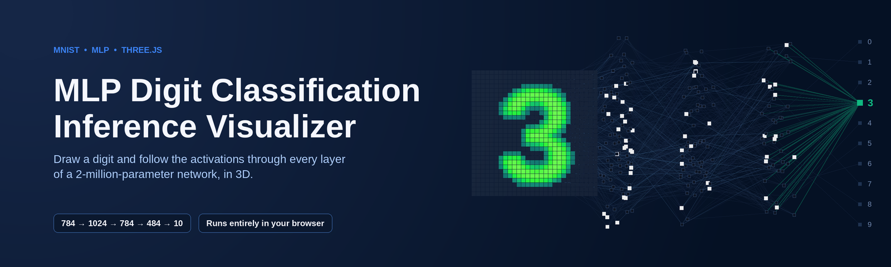
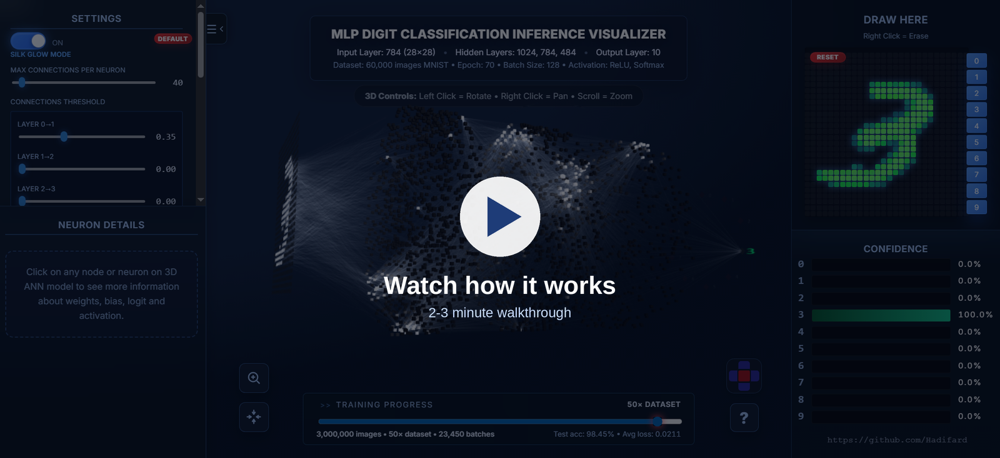
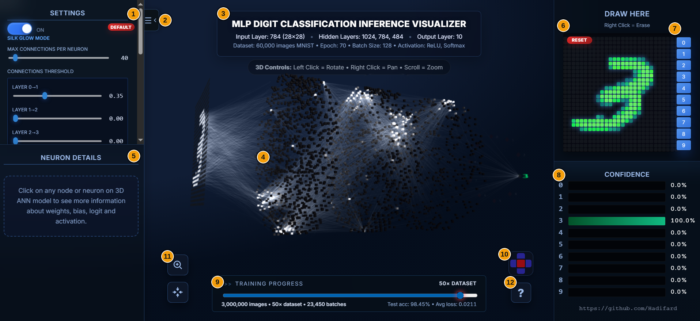
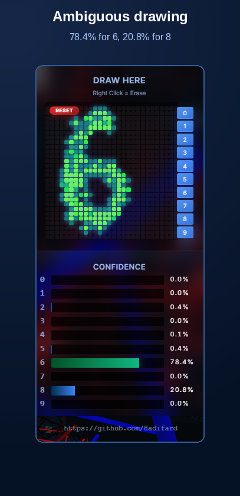
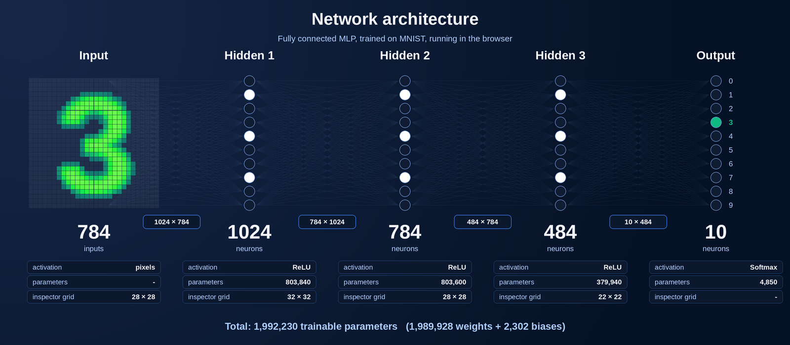
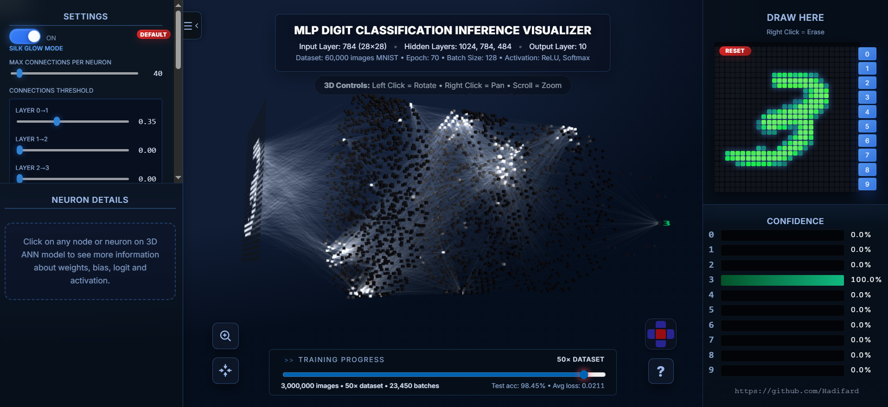
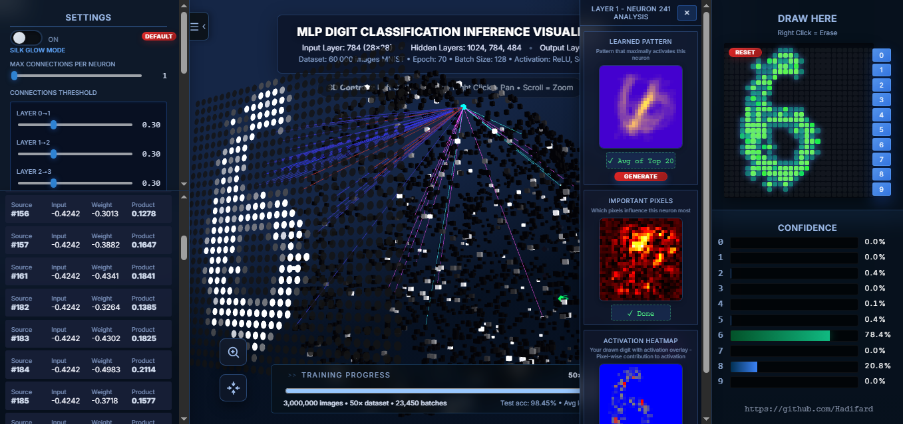
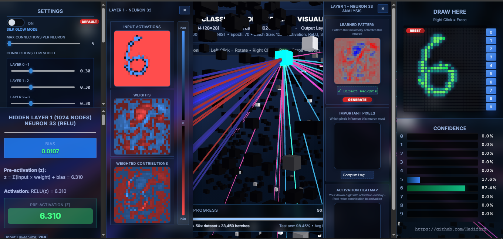
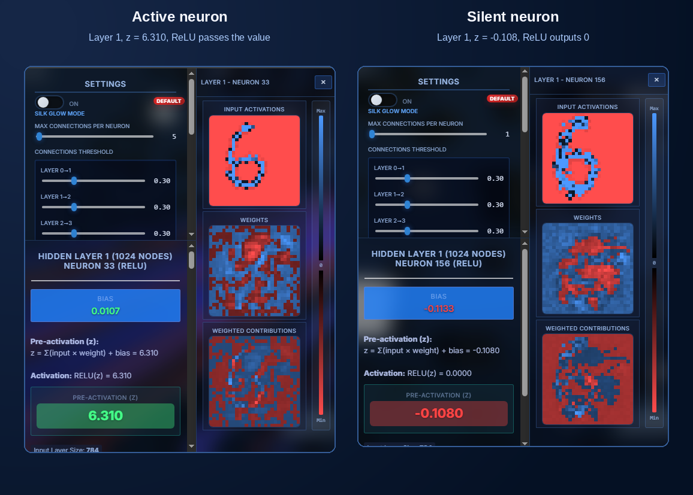
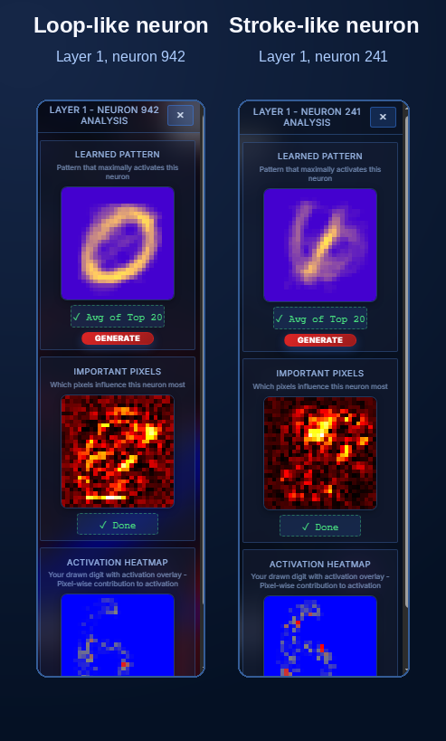

<div align="center">



# MLP Digit Classification Inference Visualizer

**Train a network in PyTorch. Watch it think, in 3D, in the browser.**

A neural network project with two sides: a **PyTorch pipeline** that trains a fully connected network (MLP) on MNIST and exports its weights, and an **interactive 3D visualizer** that runs inference on that network and shows every neuron, weight and activation live as you draw.


</div>

---

## Table of contents

1. [Why this project exists](#why-this-project-exists)
2. [Watch it in action](#watch-it-in-action)
3. [What you see on the screen](#what-you-see-on-the-screen)
4. [The network](#the-network)
5. [Quick start: your first 60 seconds](#quick-start-your-first-60-seconds)
6. [Reading the 3D scene](#reading-the-3d-scene)
7. [Inspecting a single neuron](#inspecting-a-single-neuron)
8. [Neuron analysis panel](#neuron-analysis-panel)
9. [Training timeline](#training-timeline)
10. [Settings reference](#settings-reference)
11. [Controls cheat sheet](#controls-cheat-sheet)
12. [How it works under the hood](#how-it-works-under-the-hood)
13. [Training the model (Python)](#training-the-model-python)
14. [What is in this repository](#what-is-in-this-repository)
15. [Notes and limitations](#notes-and-limitations)
16. [Author](#author)

---

## Why this project exists

Most explanations of neural networks show a small diagram with a handful of circles.
A real classifier has thousands of neurons and about two million weights, and that scale is exactly what makes it hard to build intuition.

This project tries to close that gap. Its goals are:

- **Make a real network visible.** All 1024 + 784 + 484 + 10 hidden and output neurons are drawn, not a simplified sketch.
- **Show the computation, not only the result.** Click any neuron and see its bias, its pre-activation `z`, its activation, and which input pixels pushed it up or down.
- **Let you experiment.** Draw your own digit, change a stroke, and see immediately which neurons wake up and how the confidence moves.
- **Show that learning is gradual.** A timeline slider moves through saved snapshots of the training process.
- **Stay simple to run.** Inference runs entirely in the browser. No server-side model, no data leaves your machine.

It is meant for students, teachers and anyone curious about what happens between "pixels in" and "digit out".

## Watch it in action

A short walkthrough (about 2 to 3 minutes) shows the complete workflow: drawing, exploring the 3D network, inspecting neurons and using the timeline.

[](docs/media/movie_how_it_works.mp4)

> The video file goes in [`docs/media/`](docs/media/). See [`docs/media/README.md`](docs/media/README.md) for how to add it.

## What you see on the screen



| # | Element | What it does |
|---|---------|--------------|
| 1 | **Settings panel** | Silk Glow mode, number of connections per neuron, per-layer thresholds, line thickness, brush options. |
| 2 | **Sidebar toggle** | Collapses or expands the left sidebar to give the 3D scene more room. |
| 3 | **Model summary** | Architecture, dataset and training information at a glance. |
| 4 | **3D network** | The network itself. Left click rotates, right click pans, the wheel zooms. Click a neuron to inspect it. |
| 5 | **Neuron details** | Bias, pre-activation, activation and the strongest incoming connections of the selected neuron. |
| 6 | **Drawing grid** | A 28 x 28 canvas. Draw with the left mouse button, erase with the right one. `RESET` clears it. |
| 7 | **Digit buttons 0 to 9** | Load a random MNIST test image of that digit into the grid. |
| 8 | **Confidence chart** | Softmax probability of each digit, updated live while you draw. |
| 9 | **Training timeline** | Slider over saved training snapshots, with images seen, batches, test accuracy and loss. |
| 10 | **Camera widget** | Jump to top, left, front, right or back view. |
| 11 | **Zoom tools** | Zoom to a rectangle you draw, or fit the whole network in view. |
| 12 | **Help button** | Opens the built-in About dialog with a short guide. |

Below the drawing grid the confidence chart reacts on every stroke:

<div align="center">



*An ambiguous "6": the network splits its confidence between 6 and 8.*

</div>

## The network



| Layer | Neurons | Activation | Parameters |
|-------|--------:|------------|-----------:|
| Input | 784 (28 x 28) | pixel values | - |
| Hidden 1 | 1024 | ReLU | 803,840 |
| Hidden 2 | 784 | ReLU | 803,600 |
| Hidden 3 | 484 | ReLU | 379,940 |
| Output | 10 | Softmax | 4,850 |
| **Total** | | | **1,992,230** |

Training setup shown in the application header: MNIST (60,000 training images), batch size 128, 70 epochs.
The saved snapshots on the timeline go up to 3,000,000 images seen (50 passes over the dataset) with a test accuracy of 98.45% at that point.

## Quick start: your first 60 seconds

1. **Draw** a digit in the grid on the right, for example a `3`. Hold the left mouse button and move.
2. **Look at the confidence chart** below the grid. The bar of the predicted digit grows as your drawing becomes clearer.
3. **Look at the 3D scene.** Bright neurons are strongly activated, dark ones are silent. The predicted digit label at the far right glows green.
4. **Rotate the scene** by dragging with the left mouse button. Scroll to zoom in.
5. **Click any neuron** to open the inspector and see exactly why it is bright or dark.
6. **Press a digit button (0 to 9)** to load a real MNIST test image and compare it with your own handwriting.
7. **Drag the timeline slider** to see how an early, poorly trained network reacts to the same drawing.

Tip: right click on the grid erases. This is the fastest way to fix a stroke and see the confidence change.

## Reading the 3D scene



The scene is laid out from left to right in the direction of the data flow.

- **Input layer (left).** A flat wall of 784 tiles, one per pixel. Tiles that correspond to your strokes light up.
- **Hidden layers (middle).** Each hidden layer is a **cylinder**. Neuron brightness reflects its activation after ReLU.
- **Output layer (right).** Ten labels arranged on a circle. The winner is scaled up and glows green, the others fade.
- **Connections.** Blue lines are positive weights, red lines are negative weights. Their strength reflects the weight magnitude.

### Why are the neurons grouped in colours and sectors?

Each hidden cylinder is divided into **10 sectors, one for each digit**. A neuron is placed in the sector of the digit it responds to most, measured on MNIST test images. Neighbouring neurons therefore tend to care about the same digit, and when you draw a `3` a bright cluster appears in the same region of every layer. Even-numbered layers are rotated by 180 degrees so the layers do not sit exactly behind each other.


### Silk Glow mode

Silk Glow mode replaces the solid connection cylinders with thin glowing lines. It allows many more connections to be drawn at once (the default is 40 per neuron) and shows the flow of activity through the network as soft light. Turn it off to see the strongest few connections as solid, coloured tubes and to click on individual connections.

| Silk Glow ON | Silk Glow OFF |
|:---:|:---:|
| Many faint lines, good for the big picture | Few strong, coloured connections, good for details |



*Silk mode off, one connection per neuron: blue and red tubes are positive and negative weights.*

## Inspecting a single neuron

Click a neuron in the 3D scene. Three things happen:

- The left sidebar shows the numbers of that neuron.
- A panel with three images opens on the left of the scene.
- A second panel with the neuron analysis opens on the right of the scene (next section).



### The numbers

For a neuron in a hidden layer the application shows:

```
z          = Σ (input × weight) + bias        (pre-activation)
activation = ReLU(z) = max(0, z)
```

| Value | Meaning |
|-------|---------|
| **Bias** | The learned offset of this neuron. |
| **Pre-activation (z)** | The weighted sum plus bias, before ReLU. |
| **Activation** | `ReLU(z)`. Negative `z` becomes 0 and the neuron is silent. |
| **Input layer size** | How many values feed this neuron (784, 1024, 784 or 484). |
| **Source list** | The strongest incoming connections: source neuron, input value, weight and their product. |

### The three images

The three images are shown on a square grid that matches the size of the previous layer (28 x 28, 32 x 32 or 22 x 22).

| Image | Content |
|-------|---------|
| **Input activations** | What the neuron receives. For the first hidden layer this is your drawing. |
| **Weights** | The learned weights of this neuron, blue for positive and red for negative. This is the "template" the neuron compares the input against. |
| **Weighted contributions** | `input × weight` for every source. The sum of all these values (plus bias) is `z`. |

The colour bar between the images shows the scale from **Max** (blue) through **0** to **Min** (red).

### Active versus silent

The same drawing, two neurons of the first hidden layer:



In the left neuron the blue and red contributions add up to a positive `z`, so ReLU passes it on. In the right neuron the contributions cancel out to a slightly negative `z`, so ReLU outputs `0` and the neuron stays dark in the 3D scene.

## Neuron analysis panel

The panel on the right of the scene answers a different question: *what is this neuron looking for?*



| View | Description |
|------|-------------|
| **Learned Pattern** | For first-layer neurons the raw weights are shown immediately (`Direct Weights`). Press **Generate** to replace them with the **average of the 20 MNIST test images** that activate the neuron the most (`Avg of Top 20`). |
| **Important Pixels** | A sensitivity map. Each pixel is nudged by a small amount and the change of the neuron's activation is measured. Bright areas are pixels that matter most. |
| **Activation Heatmap** | Your drawing with the pixel-wise contribution to the activation overlaid. |

In the example above, one neuron has learned a loop (a `0` or `6`-like ring) and another a diagonal stroke.

Click on any of the images to open it in a larger zoom view. `Esc` closes every dialog.

## Training timeline

The slider at the bottom moves through snapshots saved during training. Each snapshot has its own weights, so you can compare how the same drawing is handled at different moments.

- The label shows the number of images seen, the fraction of the dataset and the number of batches.
- On the right you can read test accuracy and average loss of that snapshot.
- Moving the slider swaps the weights and refreshes the 3D scene and the confidence chart instantly.

A good experiment: draw a clear digit, move the slider to the very beginning, then slowly to the end and watch the confidence and the pattern of bright neurons settle.

## Settings reference

| Setting | Effect |
|---------|--------|
| **Silk Glow Mode** | Switches between glowing thin lines and solid connection tubes. Changing it loads a suitable set of defaults. |
| **Max connections per neuron** | Keeps only the N strongest incoming connections of every neuron (1 to 784). |
| **Connections threshold, per layer** | Hides connections whose absolute weight is below the value. Separate sliders for layers 0 to 1, 1 to 2, 2 to 3 and 3 to output. |
| **Connection thickness** | Radius of the solid connection tubes. |
| **Lines opacity** *(Silk)* | Global opacity of the glowing lines. |
| **Brightness per layer** *(Silk)* | Brightness of each of the four connection groups. |
| **Brush thickness** | Radius of the drawing brush. |
| **Brush intensity** | How much one stroke increases pixel brightness. |
| **Default** | Restores the defaults of the current mode. |

Practical tips:

- Too cluttered? Lower **max connections** or raise the **threshold** of the first layer.
- Want to see which input pixels drive the first layer? Use a threshold of about `0.35` for layer 0 to 1.
- Drawing looks too thin for the network? Increase **brush thickness** a little, MNIST digits have fairly thick strokes.

## Controls cheat sheet

| Action | Input |
|--------|-------|
| Draw | Left click and drag on the grid |
| Erase | Right click and drag on the grid |
| Rotate the scene | Left click and drag in the 3D view |
| Pan the scene | Right click and drag in the 3D view |
| Zoom | Mouse wheel |
| Rotate with the keyboard | Arrow keys |
| Inspect a neuron | Click it |
| Zoom to a region | Zoom tool, then draw a rectangle (`Esc` or right click cancels) |
| Fit everything in view | Fit button |
| Standard views | Camera widget (top, left, front, right, back) |
| Load a sample digit | Digit buttons 0 to 9 |
| Close dialogs | `Esc` |

## How it works under the hood


1. **Drawing.** A soft round brush writes values between 0 and 1 into a 28 x 28 array, like an MNIST image.
2. **Forward pass.** The array is normalised and passed through the dense layers in plain JavaScript. The result contains the pre-activation and activation of every neuron.
3. **Softmax.** The ten output logits become probabilities for the confidence chart.
4. **Rendering.** [Three.js](https://threejs.org/) maps activations to colours and sizes of the 3D neurons. Only the strongest connections per neuron are drawn, since about two million weights cannot be shown at once.
5. **Inspection.** The same activations feed the neuron inspector and the analysis panel.

Other technical points:

- **Compact weights.** Trained weights are stored as Base64-encoded **Float16** buffers and decoded to Float32 in the browser.
- **Neuron clustering.** At start-up, MNIST test images are propagated through the network to find the digit each hidden neuron prefers and how selective it is.
- **No server.** All computation happens on the client.

## Training the model (Python)

This project has two sides: a **PyTorch training pipeline** that produces the network, and the **browser visualizer** that runs inference on it. The pipeline in [`src/python/`](src/python/) is what actually created the model, not an afterthought:

1. [`model.py`](src/python/model.py) defines `SmallMLP`, the 784 → 1024 → 784 → 484 → 10 fully connected network.
2. [`train.py`](src/python/train.py) trains it with PyTorch's Adam optimizer and cross-entropy loss on the MNIST training set.
3. Rather than saving one checkpoint per epoch, training pauses at a fixed list of **image-count milestones** (≈50 images, ≈120, ≈250, ... 1x, 2x, ... up to 70x the dataset) and evaluates test accuracy at each one. This is what lets the app's timeline slider scrub smoothly from "just initialised" through early, fast-changing learning to the fully converged network.
4. [`export_weights.py`](src/python/export_weights.py) casts every layer's weights and biases to **Float16**, encodes them as Base64, and writes one JSON snapshot per milestone, in the exact format [`core/weights-decoder.js`](src/js/core/weights-decoder.js) decodes back to Float32 in the browser.
5. [`prepare_mnist_test_assets.py`](src/python/prepare_mnist_test_assets.py) packs the MNIST test set into two flat binary files plus a manifest, so the "load a real digit" buttons (0-9) can fetch a sample without shipping 10,000 separate images.

## What is in this repository

This repository is a **curated overview** of the project. It contains short excerpts of the source files, so that you can see how the main ideas are implemented, together with the full documentation. It is not the complete application.

```
mnist-mlp-3d-inference-visualizer/
├── README.md / README.fa.md
├── LICENSE
├── docs/
│   ├── github-setup.md          Suggested repository settings
│   ├── how-to-use.md            Step-by-step user guide
│   ├── architecture.md          Design and code overview
│   ├── images/                  Screenshots and diagrams used in the docs
│   └── media/
│       ├── README.md            How to add the walkthrough video
│       └── movie_how_it_works.mp4   (walkthrough video)
└── src/
    ├── python/                          Model training and weight export (PyTorch)
    │   ├── model.py                         The SmallMLP network definition
    │   ├── train.py                         Training loop (Adam, milestone snapshots)
    │   ├── export_weights.py                Float16 + Base64 export for the browser
    │   └── prepare_mnist_test_assets.py     Packs MNIST test set into .bin + manifest
    ├── html/index.excerpt.html          Sidebar layout and timeline markup
    ├── css/main.excerpt.css             Colour tokens and glass-style panels
    └── js/
        ├── config/visualizer-config.js      Scene and brush configuration
        ├── core/
        │   ├── weights-decoder.js           Base64 Float16 to Float32
        │   ├── feedforward-model.js         Forward propagation (z, ReLU)
        │   └── math-utils.js                clamp, stable softmax
        ├── ui/digit-sketchpad.js            28 x 28 drawing pad and soft brush
        ├── viz/
        │   ├── connection-selection.js      Strongest connections per neuron
        │   └── neuron-layout.js             Cylinder layout by preferred digit
        └── analysis/
            ├── neuron-profiles.js           Preferred digit and selectivity
            └── feature-analysis.js          Sensitivity map, top-activating average
```

The JavaScript files are written as ES modules and have no dependencies. The Python files in `src/python/` are the offline training and weight-export side of the project; everything else in this repository is the browser-based inference and visualization side.

## Notes and limitations

- It is a **fully connected** network, not a convolutional one. It has no built-in tolerance for shifted or rotated digits, so centre your drawing and make it reasonably large, like MNIST digits.
- The **Important Pixels** map is computed for neurons of the first hidden layer, where the inputs are the 784 pixels.
- The 3D view shows a subset of all connections by design. Use the settings to choose how many.
- The accuracy shown on the timeline belongs to the selected snapshot and is measured on the MNIST test set.
- A modern desktop browser with WebGL is recommended. The scene contains thousands of objects, so a dedicated GPU gives a smoother experience.

## Author

**Hadi Sarhangi Fard**

- GitHub: [@Hadifard](https://github.com/Hadifard)
- LinkedIn: [Hadi Sarhangi Fard](https://www.linkedin.com/in/hadi-sarhangi-fard-mech-eng/)

If this project helped you understand neural networks a bit better, a star on the repository is very welcome.

## License

Released under the [MIT License](LICENSE).
