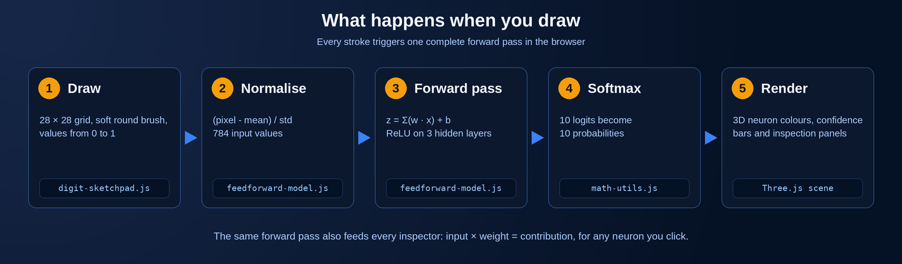
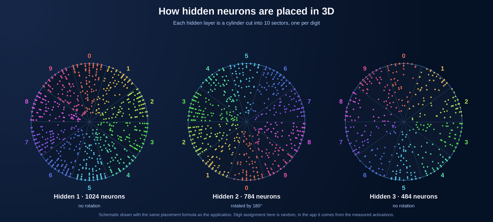

# Architecture and code overview

This document explains how the pieces of the application fit together and points to the matching excerpts in [`src/`](../src/).



## Modules

| Area | Responsibility | Excerpt |
|------|----------------|---------|
| Configuration | Layer spacing, cylinder sizes, brush, thresholds | [`config/visualizer-config.js`](../src/js/config/visualizer-config.js) |
| Weights | Decode Float16 Base64 buffers into Float32 rows | [`core/weights-decoder.js`](../src/js/core/weights-decoder.js) |
| Model | Forward propagation, pre-activations and activations of all layers | [`core/feedforward-model.js`](../src/js/core/feedforward-model.js) |
| Math | `clamp` and numerically stable `softmax` | [`core/math-utils.js`](../src/js/core/math-utils.js) |
| Input | 28 x 28 drawing pad with a soft brush | [`ui/digit-sketchpad.js`](../src/js/ui/digit-sketchpad.js) |
| Connections | Choose the strongest connections per neuron | [`viz/connection-selection.js`](../src/js/viz/connection-selection.js) |
| Layout | Place hidden neurons on cylinders by preferred digit | [`viz/neuron-layout.js`](../src/js/viz/neuron-layout.js) |
| Profiles | Preferred digit and selectivity of every neuron | [`analysis/neuron-profiles.js`](../src/js/analysis/neuron-profiles.js) |
| Analysis | Sensitivity map, average of top-activating samples | [`analysis/feature-analysis.js`](../src/js/analysis/feature-analysis.js) |
| Markup and style | Sidebar, timeline, glass-style panels | [`html/`](../src/html/index.excerpt.html), [`css/`](../src/css/main.excerpt.css) |
| Model (Python, offline) | The `SmallMLP` network definition | [`python/model.py`](../src/python/model.py) |
| Training (Python, offline) | Adam optimizer, cross-entropy loss, milestone snapshots | [`python/train.py`](../src/python/train.py) |
| Export (Python, offline) | Float16 + Base64 weight export for the browser | [`python/export_weights.py`](../src/python/export_weights.py) |
| Test assets (Python, offline) | Pack MNIST test images/labels into `.bin` + manifest | [`python/prepare_mnist_test_assets.py`](../src/python/prepare_mnist_test_assets.py) |

In the full application the 3D scene, the panels and the timeline are additional classes built on top of these parts (a Three.js scene controller, a neuron detail panel, a probability panel, a feature analysis panel and a timeline loader).

## Start-up sequence

1. Load the network definition and decode the weights.
2. Create the `FeedForwardModel`.
3. Load MNIST test samples.
4. Compute neuron profiles (preferred digit and selectivity) from a sample of the test set.
5. Build the 3D scene: input wall, three cylinders, output circle, connections.
6. Create the drawing pad and the panels and connect their event handlers.
7. Run the first forward pass and render.

## Forward pass

```
input   = (pixels - mean) / std
for each layer:
    z[j]   = bias[j] + Σ_i weights[j][i] · previous[i]
    a[j]   = relu(z[j])            hidden layers
           = z[j]                  output layer (logits)
probabilities = softmax(logits)
```

`propagate()` returns every `z` and every activation. This is the reason why the inspectors can show exact values for any neuron without recomputing anything.

## Connection selection

The network has about 1.99 million weights. For each target neuron the code:

1. discards weights below the layer threshold,
2. sorts the remaining ones by magnitude,
3. keeps the first N (the "max connections per neuron" setting).

The largest magnitude found is used to normalise the colour and opacity of the lines.

## Neuron layout

For each hidden layer the neurons are arranged in a cylinder. The angle of a neuron is decided by the digit it prefers:

```
sector = 2π / 10
theta  = digit · sector + phaseShift + spread
```

`spread` is a deterministic pseudo-random offset that keeps the neurons of one sector inside a wedge without overlapping the neighbours. Even layers use `phaseShift = π`. The radius uses `1 - r³` so that more neurons sit near the wall of the cylinder.



## Analysis methods

- **Direct weights.** The weight row of a first-layer neuron, reshaped to 28 x 28 and mapped to a blue-red scale.
- **Average of top activating samples.** All samples of a subset of the test set are propagated, sorted by the activation of the selected neuron, and the top 20 images are averaged.
- **Sensitivity map.** Finite differences: each of the 784 pixels is increased by `0.01` and the absolute change of the neuron's activation divided by `0.01` gives the sensitivity.

## Design decisions

- **Everything in the browser.** Keeps the project easy to host and lets the user experiment without latency.
- **Float16 weights.** Halves the download size compared with Float32, with no visible change in predictions.
- **Only the strongest connections.** Draws a readable picture while the computation still uses all weights.
- **Grouping by digit.** Turns an otherwise random cloud of neurons into a picture that reveals specialisation.
